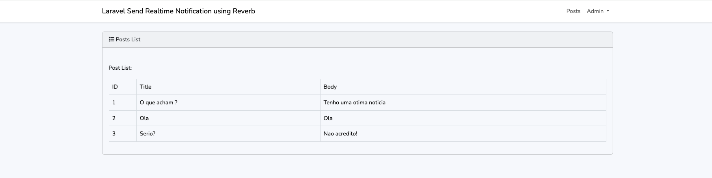

# Exemplo de notificações em tempo real do Laravel 11 Reverb

Vamos usar um driver de reverb para enviar notificações em tempo real usando o servidor Echo no projeto Laravel 11.

O que é Reverb?

Laravel Reverb traz comunicação em tempo real via WebSocket super rápida e escalável diretamente para a sua aplicação Laravel, e oferece integração perfeita com o conjunto existente de ferramentas de transmissão de eventos do Laravel.

# Versões utilizadas

- php 8.3
- npm 10.7.0
- node v18.20.4

### 

Aqui está o que foi feito nesse exemplo:

1. Criação de uma estrutura de autenticação usando Laravel UI.

2. Configuração de dois tipos de usuários: um super admin e um usuário comum. Identificados por uma coluna "is_admin" na tabela de usuários.

3. Criação de uma tabela de posts com colunas para o título e o corpo.

4. Permitir que os usuários criem posts com título e corpo.

5. Assim que um post for criado, o admin receberá uma notificação em tempo real usando o Reverb. Vamos criar o evento PostCreate para enviar a notificação em tempo real.

Passo para Exemplo de Notificação em Tempo Real com Laravel 11 Reverb  

Passo 1: Instalar o Laravel 11  
Passo 2: Criar Autenticação usando Scaffold  
Passo 3: Criar Migrations  
Passo 4: Criar e Atualizar Models  
Passo 5: Configurar o Servidor Reverb & Echo  
Passo 6: Criar Evento PostCreate  
Passo 7: Criar Rotas  
Passo 8: Criar Controller  
Passo 9: Criar e Atualizar Arquivos Blade
Passo 10: Criar Usuário Admin

Executar App Laravel


# Configurar

```bash
php artisan install:broadcasting
```

```bash
composer require laravel/reverb
```

```bash
php artisan reverb:install
```

```bash
npm install --save-dev laravel-echo
```

resources/js/echo.js
```bash
import Echo from 'laravel-echo';

import Pusher from 'pusher-js';
window.Pusher = Pusher;

window.Echo = new Echo({
    broadcaster: 'reverb',
    key: import.meta.env.VITE_REVERB_APP_KEY,
    wsHost: import.meta.env.VITE_REVERB_HOST,
    wsPort: import.meta.env.VITE_REVERB_PORT ?? 80,
    wssPort: import.meta.env.VITE_REVERB_PORT ?? 443,
    forceTLS: (import.meta.env.VITE_REVERB_SCHEME ?? 'https') === 'https',
    enabledTransports: ['ws', 'wss'],
});
```

.env
```bash
BROADCAST_CONNECTION=reverb

REVERB_APP_ID=256980
REVERB_APP_KEY=f4l2tmwqf6eg0f6jz0mw
REVERB_APP_SECRET=zioqeto9xrytlnlg7sj6
REVERB_HOST="localhost"
REVERB_PORT=8080
REVERB_SCHEME=http

VITE_REVERB_APP_KEY="${REVERB_APP_KEY}"
VITE_REVERB_HOST="${REVERB_HOST}"
VITE_REVERB_PORT="${REVERB_PORT}"
VITE_REVERB_SCHEME="${REVERB_SCHEME}"
```

```bash
php artisan db:seed --class=CreateAdminUser
```

# Executar

```bash
php artisan serve
```

```bash
php artisan reverb:start
```

```
http://localhost:8000/
```

```
admin@gmail.com
123456
```

Agora, você tem um usuário administrador e pode cadastrar novos usuários normais pelo formulário de registro.

Você pode criar postagens e o usuário administrador receberá a notificação.

Let's go


